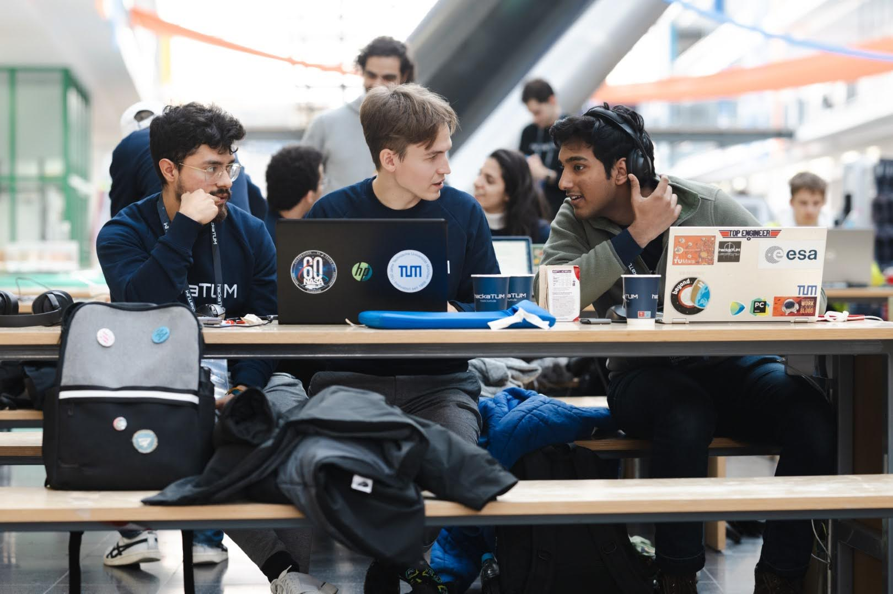
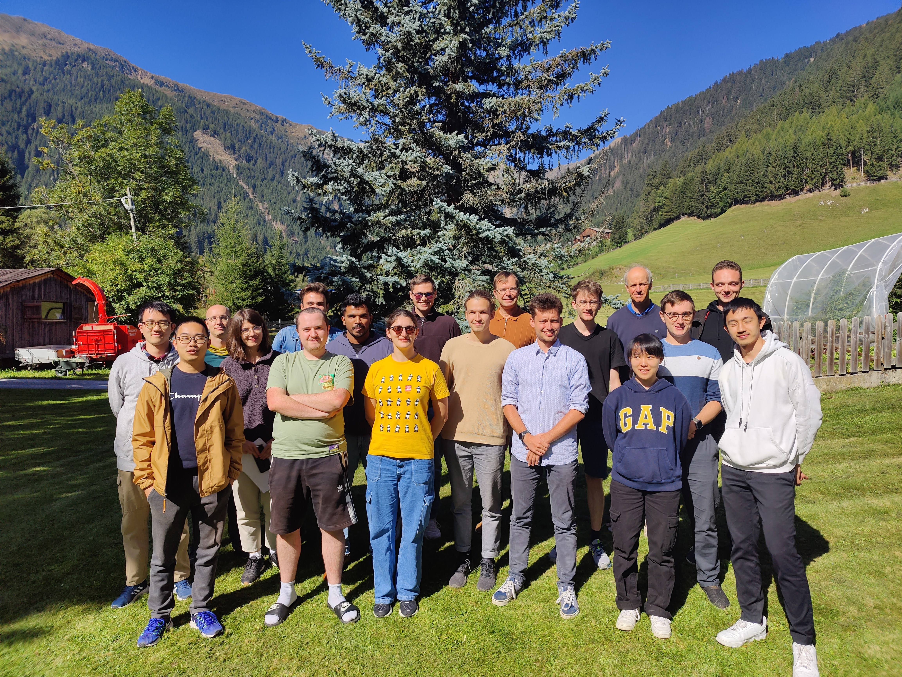
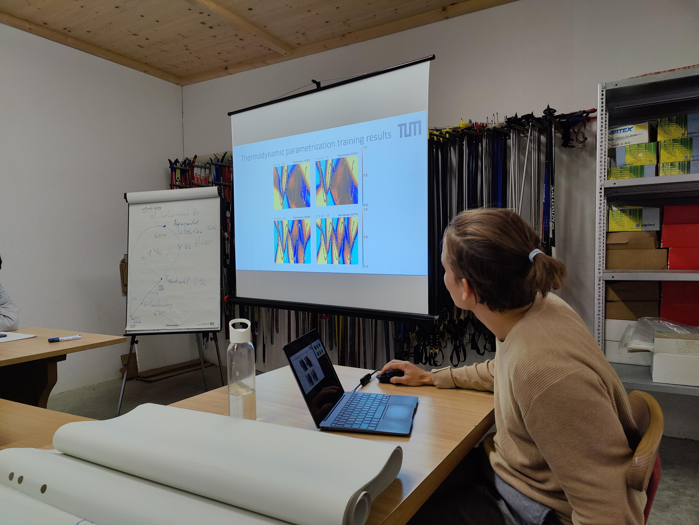
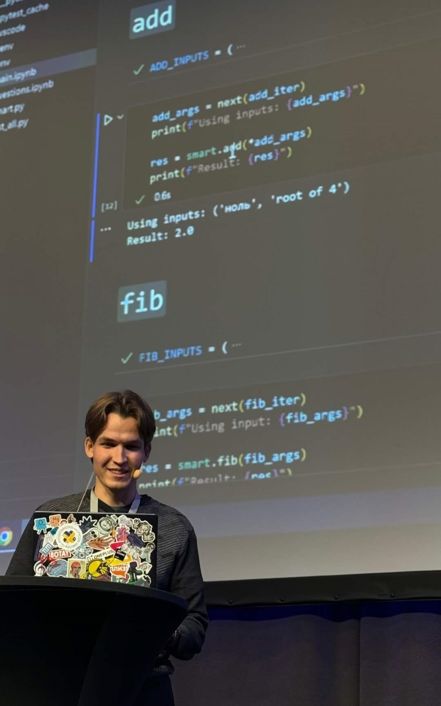
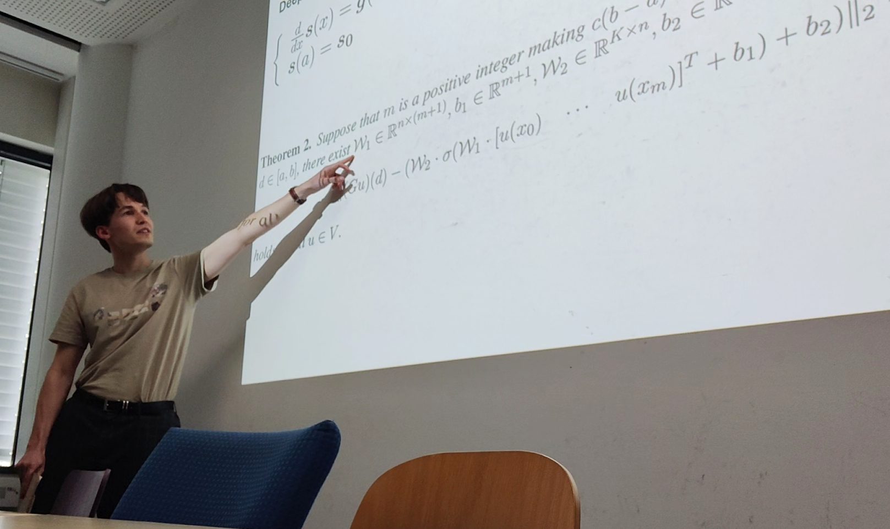
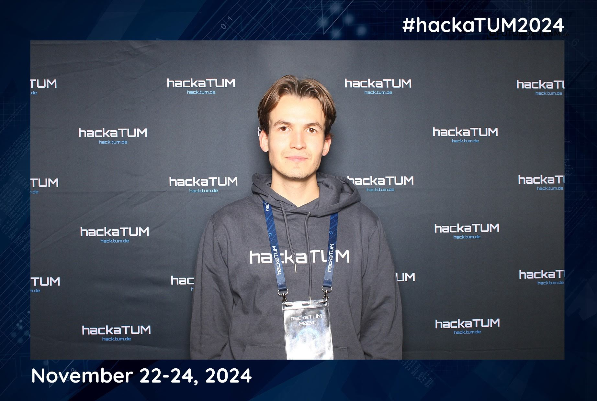
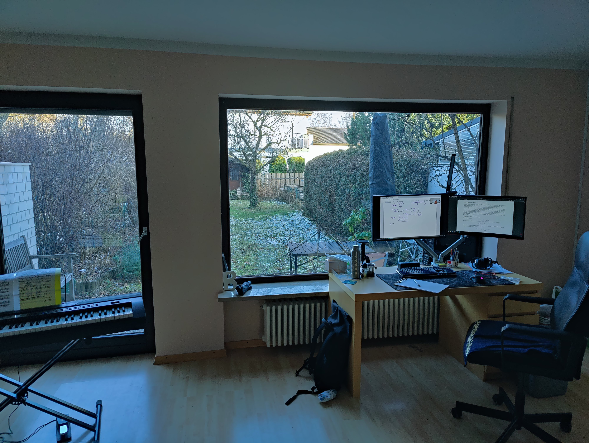
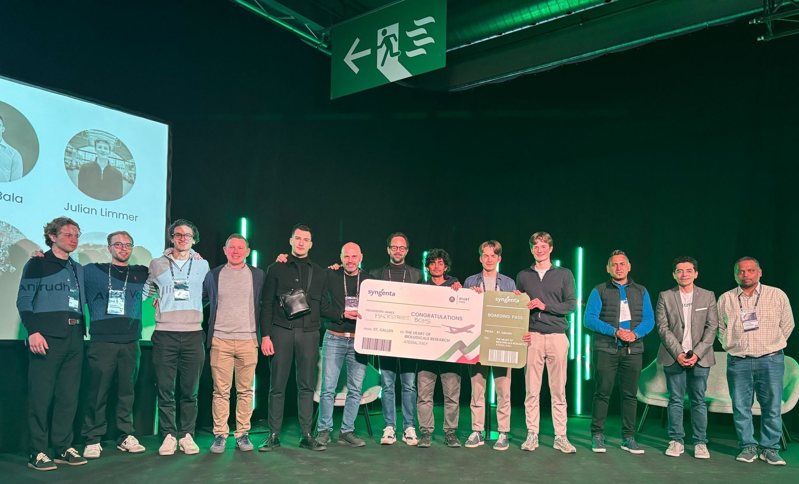
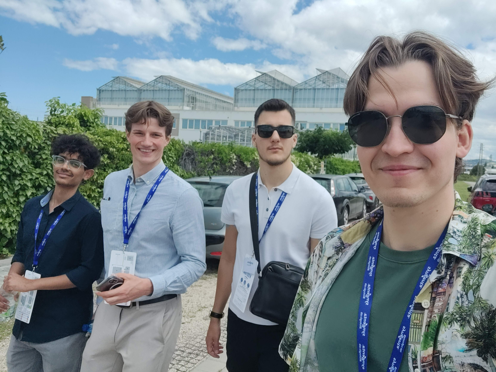
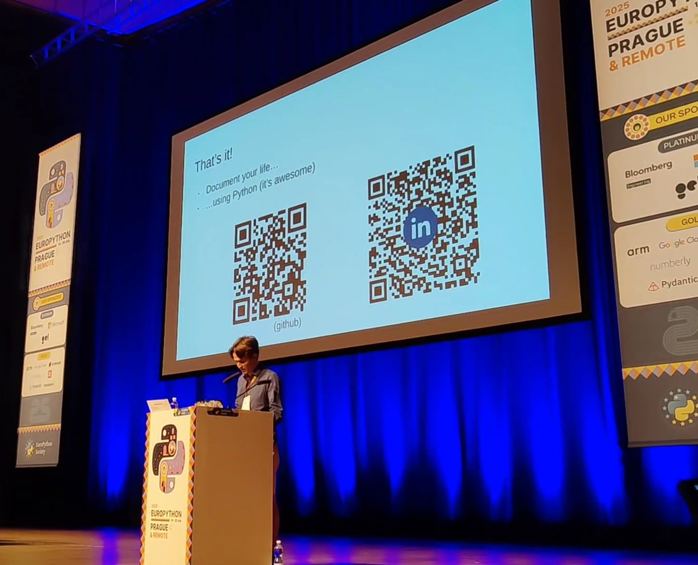

# Airat Valiullin 👋
Mathematician turned Software Developer.
Also check out my traditional one-page CV [here](files/CV.pdf). 

## **Education** 🎓
|        Period       |      School   |  Programm | Website |
|:-------------------:|:-------------:|:------:|:-----:|
| Sep 2007 - Aug 2018 |  Liceum 146, Kazan | just a normal high school (grade 1.2) | [-link-](https://edu.tatar.ru/nsav/licey146) |
| Sep 2018 - Aug 2022 |    Moscow Institute of Physics and Technology   |  `BSc` Applied Mathematics and Physics (grade 1.5) | [mipt.ru](https://mipt.ru/english/) [wiki](https://en.wikipedia.org/wiki/Moscow_Institute_of_Physics_and_Technology) |
| Oct 2022 - Jul 2025 | Technical University of Munich | `MSc` Informatics, Computational Science and Engineering (grade 1.6) | [tum.de](https://www.tum.de/en/) [wiki](https://en.wikipedia.org/wiki/Technical_University_of_Munich) |

## **Work, research and more** 🧑‍💻
### Work Experience
| Period | Position | Company | Description |
| :-: | :-: | :-: | :-: |
|Oct 2019 - Oct 2022|Private Mathematics Tutor|_self-employed_| Tutored up to 10 students per week in private sessions using own detailed lesson plans. Taught high school and olympiade level mathematics. |
|Mar 2021 - Oct 2023|Research Assistant|[Russian Academy of Sciences](https://new.ras.ru/en/) & [Institute of Applied Mechanics](https://iam.ras.ru)| Coauthored research papers on the nonlinear vibrations of overhead power lines. Conducted numerical experiments and validated the results. |
|Jun 2022 - Oct 2022|Student Intern|[Schlumberger Moscow Research Center](https://www.slb.com/)| Sketched numerical algorithms for solving the inverse acoustics problem. | 
|Feb 2023 - Oct 2023|HIWI Student|[TUM Robotics Lab](https://www.ce.cit.tum.de/en/air/home/)| Worked on a motion planning framework (MoveIt) to ensure save human-robot interaction. Assisted with motion capturing live data; analysed and visualized the sensor data. |
|Apr 2024 - May 2024|Software Developer|_freelance_| Developed a telegram bot for a local business (see [here](https://github.com/rayannott/wizard-club-bot) if I ever take it public). Set everything up from scratch: telegram API, database ORM, logging, google API, etc. |
|Jan 2024 - Jul 2025|Working Student|[ASMPT Germany](https://smt.asmpt.com/en/)| Developed dashboards for tracking unit test coverage, build reports, developer activity and other critical information; implemented multiprocessing, logging, and automated data updates; collaborated with colleagues on layout design and debugging; deployed. Analyzed extensive multiterrabyte bug report data and built a database for faster access and processing; established an ETL pipeline. Conducted numerical analysis, improving the optimization process, and handling test set generation. Performed learning on component images for error prediction (**MLOps**). |
|Aug 2025 - present|Software Developer (Cloud)|[Entrix](https://www.entrixenergy.com/en/home/)| Building fast and **not** breaking things! |

### Events
1. [International Astronautical Congress 2022](https://iac2022.org/ "IAC2022 website") (IAC2022), Paris, France, Sep 2022. 
    - My team presented our research on reinforcement learning for attitude control of a spacecraft with flexible appendages (see [above](#research))
2. 👨🏻‍💻 [HackaTUM 2022](https://hack.tum.de/past-events/events-2022/ "HackaTUM 2022 website"), Munich, Germany, Nov 2022.
    - My team solved the challenge problem of [_Rohde & Schwarz_](https://www.rohde-schwarz.com/ "Rohde & Schwarz website") about the microwave imaging technology (see code [here](https://github.com/rayannott/microwave-imaging "WARNING: bad code, just a prototype"))
3. [Ferienakademie 2023](https://www.ferienakademie.de/ "Ferienakademie website"), Sarntal, South Tyrol, Italy, Sep 2023. (see the photos [below](#gallery))
    - I participated in the seminar course _"Stochastic Evolution Equations: From martingales to applications"_ by Prof. Dr. Johannes Zimmer and Prof. Dr. Günther Grün (see course description [here](https://www.math.cit.tum.de/math/forschung/gruppen/analysis-and-mathbio/teaching/fa2023/))
    - I gave a lecture on thermodynamic parametrization of the neural networks based on [this paper](https://www.aimsciences.org/article/doi/10.3934/fods.2019019) (my [code experiments](https://github.com/rayannott/ThermodynamicParameterizationOfNNs) for the talk)
    - I also went to many hikes and had a lot of quality time with my fellow students and professors <!-- (I hope they take me again next year 😋); upd: they didn't :( -->
4. 👨🏻‍💻 [HackaTUM 2023](https://hack.tum.de/past-events/events-2023/ "HackaTUM 2023 website"), Munich, Germany, Nov 2023. (see the photos [below](#gallery); I'm on the main page photo there)
    - My team solved the challenge problem of [_Optiver_](https://www.optiver.com/ "Optiver website") about the market making with sentiment analysis on the news (sadly, I can't share the code because the organizers asked us not to)
5. 🐍 [PyCon Sweden 2024](https://www.pycon.se/ "pycon in Stockholm"), Stockholm, Sweden, Nov 2024.
    - I attended the following talks and workshops: ... (see the source code for the comments: I hid them here because the list is too long);
    <!-- [Write Load Tests in Python and Run Them in the Cloud in 15 Minutes](https://pretalx.com/pyconse-2024/talk/RVU97H/), [Beyond the "Hello, World!"](https://pretalx.com/pyconse-2024/talk/CCPCRS/), [Let's goto work](https://pretalx.com/pyconse-2024/talk/EWW8ZJ/), [Documenting Python Code](https://pretalx.com/pyconse-2024/talk/X7DH3L/), [Get old, go slow, write code!](https://pretalx.com/pyconse-2024/talk/NVZQSS/), [Tech as a Gateway: Unlocking Opportunities for Women and Immigrants in the Digital Age](https://pretalx.com/pyconse-2024/talk/C9KQE3/), [A challenge of converting a project's core to asyncio](https://pretalx.com/pyconse-2024/talk/Q9QSKZ/), [It's About Time](https://pretalx.com/pyconse-2024/talk/QHFSDN/), [Parallel Python: Embracing the Future with Sub-Interpreters and Free Threading](https://pretalx.com/pyconse-2024/talk/Q9QSKZ/); [Launching, failing & growing AI business & teams through challeges & AI trends](https://pretalx.com/pyconse-2024/talk/DWKHFC/), [Accidentally popular: Beautiful CLI interfaces with rich-click](https://pretalx.com/pyconse-2024/talk/XP7GWN/), [Advanced parsing of structured data using Python's new match statement](https://pretalx.com/pyconse-2024/talk/JPZ7WK/), [Query your structured data with a LangChain AI agent](https://pretalx.com/pyconse-2024/talk/JTYDDY/), [Building Python based AI Systems with LLMs](https://pretalx.com/pyconse-2024/talk/SYQP9E/), [Boring Releases: How We Ship Every Week Without Drama](https://pretalx.com/pyconse-2024/talk/T8AWNE/), [Controlling lab and production equipment with Python](https://pretalx.com/pyconse-2024/talk/D3GPCM/) -->
    - I gave a quick lightning talk "**Should** We Use AI for Everything?"
6. 👨🏻‍💻 [HackaTUM 2024](https://hack.tum.de/), Munich, Germany, Nov 2024. ([photos](#gallery))
My team solved the challenge problem of 
    - [Optiver](https://www.optiver.com/) (again!) about the market making with a twist we were asked not to share :) 
    - [Solana](https://solana.com/): chess on blockchain with smart contracts
7. 🐍 [PyData Global 2024](https://pydata.org/global2024/), _virtual_, Dec 2024.
8. 👨🏻‍💻🥇 [START Hack Munich](https://www.startmunich.de/), Munich, Germany, Dec 2024. ([photos](#gallery))
    - My teammates and I solved the DELL's challenge: we've developed the AI-chatbots for the startup aggregator using `svelte` for the frontend and `langchain`/`openai` with `fastapi` for the backend
    - _AND we actually won it!_ 🎉 (see the devpost page [here](https://devpost.com/software/dell-hackstreet-boys))
    - Take a look at the backend [here](https://github.com/rayannott/dell-chatbot) (when and if we take it public that is — the negotiations with DELL contunue about selling the solution)
9. 👨🏻‍💻🥇 [START Hack St. Gallen](https://www.startglobal.org/start-hack/home/), St. Gallen, Switzerland, Mar 2025. ([photos](#gallery))
    - My team and I solved the challenge of Syngenta about the data-driven recommendation app for the farmers; once again, we used `svelte` for the frontend and `fastapi` for the backend, as well as linking the company-provided data to make the recommendations
    - _AND we won it (**yes, again**)!_ 🎉 (see the devpost page [here](https://start-hack-2025.devpost.com/))
10. 👨🏻‍💻 [TUM.ai Makeathon](https://makeathon.tum-ai.com/), Munich, Germany, Apr 2025.
    - We solved the OpenAI wild track challenge and built a secure wrapper around private company datasets for the student agents to pay-and-learn from it;
    - Take a look at our terrible code [here](https://github.com/kaandrmz/tumai-oai)!
11. 🐍 [EuroPython 2025](https://europython.eu/), Prague, Czech Republic, Jul 2025.
    - Wonderful speakers, inspiring talks, I will definitely come again;
    - I gave a lightning talk again (see gallery) -- this time on building [personal tools](https://github.com/rayannott/moviesdb) with Python
12. 🐍 [pytest](https://pyte.st/) workshop, Munich, Germany, Jul 2025.
    - A workshop on pytest — a testing framework for Python
    - Back at the EuroPython, [Florian Bruhin](https://bruhin.software/) gave a talk on testing but I coundn't make it then; so, I attended his workshop hosted in the Entrix & flexa office

### Research
|Date|Title & Link|Notes|
| :-: | :-: | :-: |
|Jan 2022|[Reinforcement Learning for Attitude Control of a Spacecraft With Flexible Appendages](https://www.researchgate.net/publication/363840944_REINFORCEMENT_LEARNING_FOR_ATTITUDE_CONTROL_OF_A_SPACECRAFT_WITH_FLEXIBLE_APPENDAGES)|International Astronautical Congress (IAC2022) conference paper|
|Jun 2022|Verification of Solutions to Wave Equations Using Integral Transformations|Bachelor thesis (not published), [code](https://github.com/rayannott/wave_pde_analytical "WARNING: bad code"), [text](files/BSc-thesis.pdf)|
|Sep 2022|[Normal Vibrations of Sagging Conductors of Overhead Power Lines](https://doi.org/10.22337/2587-9618-2022-18-3-147-158)|Mechanics journal paper in colaboration with the Russian Academy of Sciences (RAS)|
|Jul 2025|Guiding the Unrolling Curricula of Autoregressive Neural Simulators|Master thesis (not published), [code](https://gitlab.lrz.de/00000000014B568C/masters-thesis.git), [text](files/MSc-thesis.pdf)|

## **Skills** 📚
### Human Languages
| Language   |  Level |
|----------|:-------:|
| English |  C2 |
| German | B2 |
| Russian | native/bilingual|
| Tatar | native/bilingual |

### Technical Skills
> [!NOTE]
> _I'm not a big fan of how this section looks like. Please, submit your formatting suggestion here: https://github.com/rayannott/rayannott/issues/1._

Colour coding: 
🟣 expert, 🟢 proficient, 🟠 advanced, 🔵 competent, ⚪ beginner.
#### Programming languages
- 🟣 Python! (yes, the whole stack)
- 🟠 SQL
- 🟠 C++ (`omp`, `MPI`, `SIMD`, `Qt`)
- 🔵 shell
- 🔵 MATLAB, Rust, R, Julia

#### Other
- 🟣 VSCode
- 🟣 algorithms, data structures
- 🟢 AWS and `cdk` (esp. python)
- 🟢 CD/CI
- 🟢 Linear, Notion, Slack
- 🟢 NoSQL (mongodb, dynamodb)
- 🟢 signal processing, information retrieval
- 🟢 git (in GitHub[actions, PR, issues, etc.], GitLab, TFS)
- 🟢 Linux (Fedora 💚, Ubuntu, Amazon Linux, WSL and more)
- 🟢 $\LaTeX$
- 🟢 Docker
- 🟠 ETL/ELT
- 🔵 Draw.io, SolidWorks, Figma

## Courses
### University Courses
Here are _some_ courses I took during my bachelor's and master's studies: 
| Mathematics | Physics | Informatics and Computer Science |
|-------------|---------|--------------------------------|
| Calculus I/II/III | Mechanics | [Machine Learning](https://www.cs.cit.tum.de/daml/lehre/wintersemester-202021/machine-learning/)|
| Linear Algebra | Thermodynamics | [Deep Learning](https://niessner.github.io/I2DL/)|
| Probability Theory and Statistics | Electricity and Magnetism | [Algorithms and Data Structures](https://www.cs.cit.tum.de/tcs/lehre/ws22-23/fundamental-algorithms-cse/) |
| Differential Equations | Optics | [Parallel Programming](https://www.ce.cit.tum.de/caps/lehre/ss20/vorlesungen/parallel-programming/) |
| Partial Differential Equations | Nuclear Physics | [Information Retreival in High-Dimentional Data](https://www.ce.cit.tum.de/en/ldv/lehre/information-retrieval-in-high-dimensional-data/) |
| Numerical Analysis | Fluid Mechanics | Data Analysis |
| Complex Analysis | Solid Body Mechanics | [Visual Data Analytics](https://www.ph.tum.de/academics/org/cc/course/950495973/?language=en) |
| Mathematical Modelling | Theoretical Mechanics | [Machine Learning for Graphs and Sequential Data](https://www.cs.cit.tum.de/daml/lehre/sommersemester-2023/machine-learning-for-graphs-and-sequential-data/) |
| [Game Theory](https://www.cs.cit.tum.de/en/dss/teaching/summer-semester-2021/algorithmic-game-theory-in2239-ss21/) | Practical Labs (in all of the above) | [Deep Learning in Physics (seminar)](https://www.cs.cit.tum.de/cg/teaching/summer-term-24/deep-learning-in-physics/) with [this](https://arxiv.org/abs/1910.03193) paper (see picture below and timelapse [here](https://t.me/meinluftschloss/844))|
| [Numerical Programming I/II](https://www5.in.tum.de/lehre/vorlesungen/num_prog_cse/ws07/) | Quantum Mechanics | [Computational Neuroscience](https://www.ce.cit.tum.de/en/aip/teaching/computational-neuroscience-a-lecture-series/) |
| [Mathematical Models in Biology](https://academics.nat.tum.de/org/mh/details/mod/MA3601) | Statistical Physics | |
| | Control Theory | |
| | [Image Processing in Physics](https://academics.nat.tum.de/org/mh/details/mod/PH2181/) | | 

### Other Courses
Fortunately, there is a ton of freely available courses on the internet: YouTube, Coursera, edX have quite a lot of content; some universities also have open courses on their websites.
Here are some of the courses I took:
- [DeepMind x UCL | Reinforcement Learning](https://www.youtube.com/playlist?list=PLqYmG7hTraZBKeNJ-JE_eyJHZ7XgBoAyb) by Hado Van Hasselt
- [AWS Certified Cloud Practitioner](https://www.udemy.com/course/aws-certified-cloud-practitioner-new/) by Stephane Maarek

## **Interests** 🎨
- piano (check out [this clip](https://youtube.com/clip/UgkxlRIhGJqhNfKIHo6oJgLqtGlehYs2RzR_?si=ztX3tDY_P7VGRzS1 "Chopin - Nocturne Op. 9 No. 2")), guitar, and a bit of drums
- teaching ([coding](https://github.com/rayannott/teaching-coding), for example; there's also math olympiades, but it's all in Russian)
- learning
- swimming, cycling and hiking (occasionally, jogging)
- coding
    - algorithms
    - puzzle games
    - conducting technical interviews
    - writing unreadable one-liners in Python: [check out here](https://gist.github.com/rayannott/3291a185744d7c71ab14844ff3d9b484) (and feel free to add more)
    - check out my progress on [leetcode](https://leetcode.com/rayannott/)
    - check out my progress on [ProjectEuler](https://projecteuler.net/friends) (see badge below; add me as a friend: `1806518_hxYZDigZ3jQjJZgworwIBfFyol0Qwaj8`)
    
- cinema (let's talk about movies and take a look at my [personal database](https://github.com/rayannott/moviesdb)!)
- reading (mostly the classics: Russian and English); some of my favorites include: [Perfume](https://en.wikipedia.org/wiki/Perfume_(novel)), [Собачье сердце](https://en.wikipedia.org/wiki/Heart_of_a_Dog), [Animal Farm](https://en.wikipedia.org/wiki/Animal_Farm), [Matilda](https://en.wikipedia.org/wiki/Matilda_(novel)), [Pygmalion](https://en.wikipedia.org/wiki/Pygmalion_(play))
- digital photography (search `#ph` hashtag in my personal [Telegram channel](https://t.me/meinluftschloss))
- cooking (yes!)

## **How to reach me** 📫
Send me an email: airat.valiullin@tum.de or

## **Projects I Endorse**
and actually use (in no particular order):
- [python](https://www.python.org/) - a programming language made for humans
- [rich](https://github.com/Textualize/rich) - a Python library for rich text and beautiful formatting in the terminal (see also [rich_click](https://ewels.github.io/rich-click/latest/))
- [project euler](https://projecteuler.net/) - a collection of math+coding problems
- [daylio](https://daylio.net/) - a digital diary (with an "export as table" feature that empowered [this](https://github.com/rayannott/daylio-analysis))
- [ticktick](https://www.ticktick.com/home) - a digital planner and tasks tracker
- [telegram](https://telegram.org) - a powerful messaging app
- [desmos](https://www.desmos.com/) - a collection of free math tools
- [7zip](https://www.7-zip.org/) - please don't use winrar
- [obs](https://obsproject.com/) - an open source software for video recording and live streaming
- [photopea](https://www.photopea.com/) - a free web-based image editor
- [rawtherapee](https://www.rawtherapee.com/) - an open source raw image processing software
- [regexlearn](https://regexlearn.com/) - an interactive platform for learning regular expressions
- [factorio](https://factorio.com/) - the best factory-building video game about logistics, resource management and optimization
- [linear](https://linear.app/) - a very good all-in-one issue tracking and project management app with amazing tool integration
### YouTube Channels
I can't stress enough how much amazing free content there is on YouTube, and here are some of my favorite channels:
- [numberphile](https://www.youtube.com/@numberphile) - popular maths
- [3blue1brown](https://www.youtube.com/@3blue1brown) - visual maths
- [anthonywritescode](https://www.youtube.com/@anthonywritescode) - python programming
- [Computerphile](https://www.youtube.com/@Computerphile) - popular computer science
- [Reducible](https://www.youtube.com/@Reducible) - algorithms visualized
- [NotJustBikes](https://www.youtube.com/@NotJustBikes) - cities and urban planning
- [RobWords](https://www.youtube.com/@RobWords) - linguistics
- [SebastianLague](https://www.youtube.com/@SebastianLague) - (physics) simulations
- [SpanningTree](https://www.youtube.com/@SpanningTree) - visual math and computer science
- [vcubingx](https://www.youtube.com/@vcubingx) - visual math and computer science
- [StuffMadeHere](https://www.youtube.com/@StuffMadeHere) - DIY, overcooked
- [TechnologyConnections](https://www.youtube.com/@TechnologyConnections) - the technology behind everyday devices
- [EthanChlebowski](https://www.youtube.com/@EthanChlebowski) - cooking

## **My GitHub Summary** 

more on badges: https://github.com/alexandresanlim/Badges4-README.md-Profile

## **Gallery** 📷

Я осуждаю [агрессию России против Украины](https://ru.wikipedia.org/wiki/%D0%92%D1%82%D0%BE%D1%80%D0%B6%D0%B5%D0%BD%D0%B8%D0%B5_%D0%A0%D0%BE%D1%81%D1%81%D0%B8%D0%B8_%D0%BD%D0%B0_%D0%A3%D0%BA%D1%80%D0%B0%D0%B8%D0%BD%D1%83_(%D1%81_2022)). Мир в Украине 🇺🇦. Свободу России 🇷🇺
