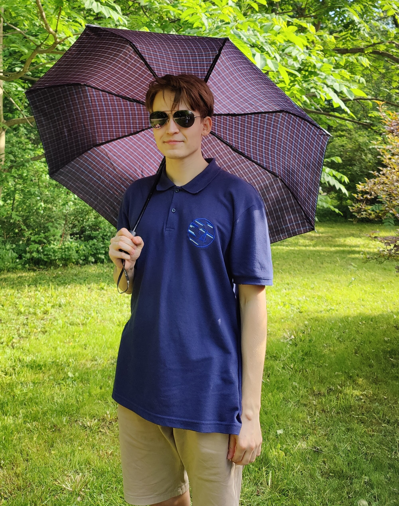

# Hi there 👋
You've reached my personal GitHub page!\
Let this `README.md` be my CV-demo 😉 (not sure it's supposed to be that though)

## **Education** 🏫
|        Period       |      School   |  Programm | Website |
|:-------------------:|:-------------:|:------:|:-----:|
| Sep 2007 - Aug 2018 |  Liceum 146, Kazan | just a normal high school | [-link-](https://edu.tatar.ru/nsav/licey146) |
| Sep 2018 - Aug 2022 |    Moscow Institute of Physics and Technology   |  ${\color{LimeGreen}\text{BSc}}$ Applied Mathematics and Physics (4.74/5.00) | [mipt.ru](https://mipt.ru/english/) |
| Oct 2022 - Mar 2025 (exp) | Technical University of Munich | ${\color{LimeGreen}\text{MSc}}$ Computational Science and Engineering (Informatics) | [tum.de](https://www.tum.de/en/) |

## **Work, research and more** 👨‍🔬
### Work
I worked here and there. Currently, I work here: ...
### Research
- [Reinforcement Learning for Attitude Control of a Spacecraft With Flexible Appendages](https://www.researchgate.net/publication/363840944_REINFORCEMENT_LEARNING_FOR_ATTITUDE_CONTROL_OF_A_SPACECRAFT_WITH_FLEXIBLE_APPENDAGES): International Astronautical Congress (IAC) 2022 conference paper;
- [Verification of Solutions to Wave Equations Using Integral Transformations](https://www.overleaf.com/read/cscghhcmgjwn#7e5ff8): Bachelor of Science graduation thesis (not published), [code](https://github.com/rayannott/wave_pde_analytical "WARNING: bad code");
- [Normal Vibrations of Sagging Conductors of Overhead Power Lines](https://ijccse.iasv.ru/index.php/ijccse/article/view/558): mechanics journal paper in colaboration with the Russian Academy of Sciences (RAS);
- more to come!

### Events
I participated in the following cool events: ...
<!-- IAC2022  HackaTUM22 R&Stour HackaTUM23-->

## **Skills** 🥇
### Technical
Colour coding: 
${\color{Orchid}\text{expert}}$,
${\color{Green}\text{proficient}}$, 
${\color{Orange}\text{advanced}}$, 
${\color{Turquoise}\text{competent}}$, 
${\color{Grey}\text{beginner}}$

#### Programming languages
- Python
    - numpy, scipy, sympy
    - matplotlib
    - pandas
    - pytorch
    - plotly, plotly dash
    - pygame, pygame_gui
    - tkinter
    - streamlit
    - flask
- C++
- MATLAB
- R
- Julia
- SQL

#### Other
- git (GitHub, GitLab)
- Linux (Ubuntu)
- Docker
- LaTeX
- SolidWorks
- MSOffice (duh...)
- Figma

### Theoretical
I can math, algorithms, physics, yada yada
#### Human Languages
| Language   |  Level |
|----------|:-------:|
| English |  [C1/C2](https://drive.google.com/file/d/1iolYW3rq6XkjpksnMkJvFKeyySMtdwK8/view?usp=sharing "IELTS band 8.0 (view certificate; WARNING: bad photo)") |
| German | A2/B1 |
| Russian | native |
| Tatar | native |

## **Interests** 🙂
I like and sometimes do these things: ...

## **How to reach me** 📫
- ✉️ send me an email: airat.valiullin@tum.de
- 💬 text me on Telegram: [`@rayannott`](https://t.me/rayannott)
- 📷 DM me on Instagram: [`@rayannott`](https://www.instagram.com/rayannott)
- 🧑‍💼 add me on LinkedIn: [Airat Valiullin](https://www.linkedin.com/in/airat-valiullin-067718256/)
- 🎧 add me on Discord: `@rayannott`
- 💩 text me on WhatsApp: _just kidding, please don't_

